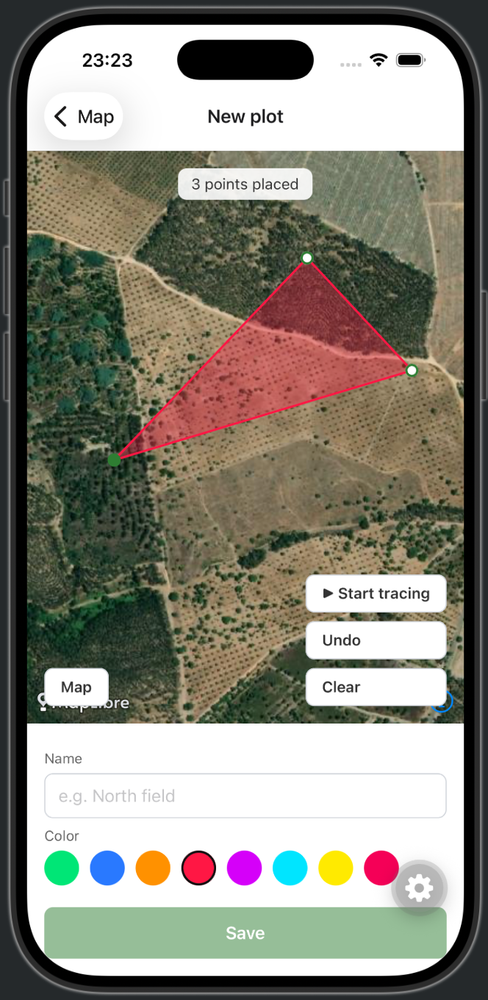

# Plot Pilot

A mobile app (iOS/Android) that helps people map, manage, and track agricultural land — plots, activities, and key records in one place, replacing scattered notebooks, spreadsheets, and memory.

## Features (MVP)

- Draw plot boundaries on a map (tap-to-place or GPS walk/drive), with auto-calculated area and perimeter
- Plot profile pages: crop, soil type, notes
- Log activities against a plot (planting, spraying, irrigation, harvesting, etc.), with autocomplete on previously used types
- Per-plot activity feed and a combined timeline across all plots
- Dashboard with plot count, recent activity, search, and filter by crop
- Fully offline — all data is stored on-device (SQLite) and is the source of truth, no accounts or cloud sync
- English and European Portuguese (pt-PT) localization

## Screenshots



Drawing a plot boundary by tapping points over the satellite basemap — area, color-coding, and a live preview before saving.

## Tech Stack

- [React Native](https://reactnative.dev/) via [Expo](https://expo.dev/) (TypeScript)
- [MapLibre](https://maplibre.org/) with OpenStreetMap tiles for mapping
- [expo-sqlite](https://docs.expo.dev/versions/latest/sdk/sqlite/) for on-device storage
- [i18next](https://www.i18next.com/) / [react-i18next](https://react.i18next.com/) for localization

## Getting Started

This app uses native modules (MapLibre, SQLite, Location, a native date picker) that aren't included in [Expo Go](https://expo.dev/go), so it needs a [custom development build](https://docs.expo.dev/develop/development-builds/introduction/) instead:

```bash
npm install
npx expo run:ios      # or: npx expo run:android
```

This builds and installs a dev client on a simulator/emulator (add `--device` to target a connected physical device), then starts Metro and opens the app automatically. After that, `npm start` is enough for day-to-day work — you only need `run:ios`/`run:android` again after adding a native dependency or changing native config in `app.json` (e.g. `userInterfaceStyle`, permissions).

There's no web target: this app doesn't include `react-native-web`.

## License

MIT — see [LICENSE](./LICENSE).
